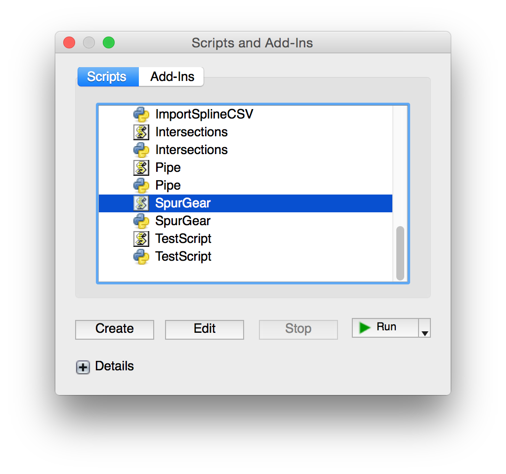
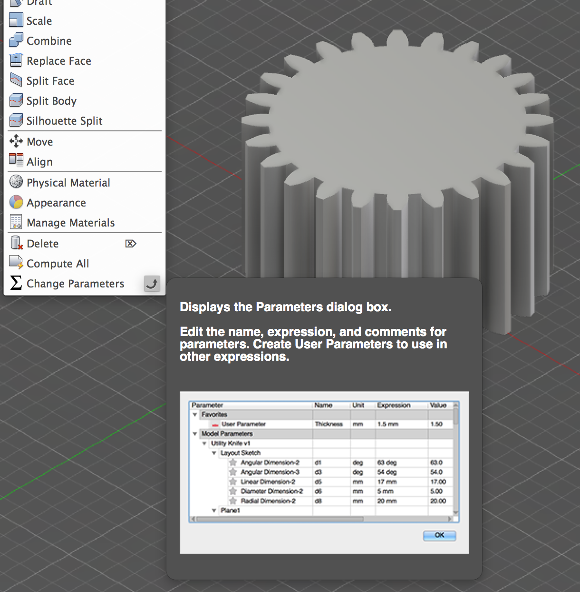
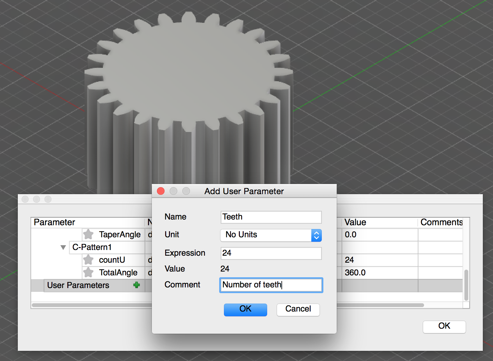
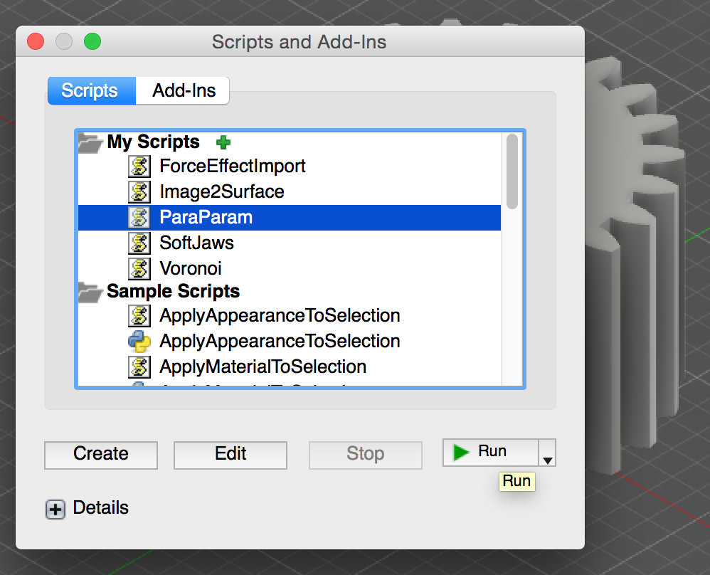

#  Fusion360ParaParam

This script is used for parametrically modifying a user parameter.  For each iteration an operation may be performed such as exporting to STL.  This is very useful for automating variations of a design and exporting those variations.

*NOTE* The set of operations are limited in this initial release.  More added later.

![Image of ParaParam Dialog]
(./resources/ParaParams-Step-7-ParaParam-Dialog.png)

## Installation

Copy the "Fusion360ParaParams" folder into your Fusion 360 "My Scripts" folder. You may find this folder using the following steps:

1. Start Fusion 360 and then select the File -> "Scripts and Add-Ins..." menu item
2. The Scripts and Add-Ins dialog will appear and display the "My Scripts" and "Sample Scripts" folders
3. Select one of the "My Scripts" files and then click on the "+" Details icon near the bottom of the dialog.
  - If there are no files in the "My Scripts" folder then create a default one by clicking the Create button, select JavaScript, and then OK.
4. With a user script selected and the "Details" section expanded, look at the Full Path value.  This contains the location of the user scripts folder.
5. Copy this script's folder into that location.
  For example, on my Mac the folder is located in:
    /Users/USERNAME/Library/Application Support/Autodesk/Autodesk Fusion 360/API/Scripts
  And on Windows:
    C:\users\USERNAME\AppData\Roaming\Autodesk\Autodesk Fusion 360\API\Scripts
6. Now add the script to the lists of "My Scripts"
7. Click the "+" icon next to the "my Scripts" item
  - The "Add new script" dialog should appear.
8. Locate the ForceEffectImport.js file in the folder you copied, select it, and click Open. The script should now be installed and ready to be run.

The script should be ready to run.

## Usage

1. Run the "ParaParam" script from the Script Manager
2. The settings dialog will be shown.  Adjust to your preferences:

  

  - Which Parameter : Select the user parameter to modify
  - Start Value : Initial value
  - End Value : Last value
  - Increment Value : The amount to increment each iteration
  - Operation: Select the operation to perform each iteration
    - Value Only : Only change the parameter value
    - Export to _Type_ : Export the design to specified type
  - Pause Each Iteration : Pauses script each iteration
3. Click OK to begin

Note, after the script has run the design changes may be undone using Edit -> Undo.

### Iterations

The start, end, and increment values define the iteration and the values that are assigned to the selected user parameter. For example, if your design has a user parameter "Height" that you would like to set to values from 1 to 4 inches every 0.5 inches then you would specify:

- Start Value = 1 in
- End Value = 4 in
- Increment Value = 0.5 in

That will assign the sequence of values [1, 1.5, 2, 2.5, 3, 3.5, 4] to the "Height" user parameter.

If you would like to iterate in reverse then specify a start value larger than the end value but use a positive increment.  For example:

- Start Value = 4 in
- End Value = 1 in
- Increment Value = 1.0 in

That will assign the values [4, 3, 2, 1] to the user parameter.

In essence, this is performing a [For loop](http://en.wikipedia.org/wiki/For_loop).

### Export Operation

The current design may be exported after each iteration. When one of the export operations is selected, the script will prompt for a filename to use for export.  The filename is used as a template for the exported files. For each iteration the specified filename has the user parameter name as well as the current iteration value appened to it.

For example, if exporting STL with a filename of "MyModel" and the following settings:

- Parameter Name = "Height"
- Start Value = 1 in
- End Value = 4 in
- Increment Value = 1 in

Then the filenames produced would be:

- "MyModel_Height_1.stl"
- "MyModel_Height_2.stl"
- "MyModel_Height_3.stl"
- "MyModel_Height_4.stl"

### Example Usage

Here is an example of using the script to export several variations of a design.

1. Start Fusion 360
2. In a new document, run the SpurGear (Javascript) script and use the default values to generate the gear.

  

3. Display the Change Parameters dialog after the gear has been created.

  

4. In the dialog, click the green '+' icon next to the User Parameters category.
5. In the Add User Parameter dialog, set the name to "Teeth", unit to "No Unit", expression to 24, then click OK.

  
  

6. Now change the "countU" model parameter's expression to "Teeth"

  

  The model parameter is now being driven by the "Teeth" user parameter.
7. Click the OK button to close the parameters dialog.
8. Run the ParaParam script

  

9. In the settings dialog, select the "Teeth" parameter name, start value of 8, end value of 32, increment of 4, and operation to "Export to STL".

  

10. Click OK to start the ball rolling
11. Since an export operation was selected the script will prompt for a filename to export to.  Choose a folder and then enter a name without an extension. For example, create a new folder named "SpurGears" and then a filename of "Gear".  Click OK.
12. The script should finish and the specified folder will now contain a series of STL files.  Each file containing the state of the design for at the specific iteration.

  

Optionally, you may want to select Edit -> Undo to undo the changes to the design made by the ParaParam script.  That allows you to run again from the initial state.

## Issues

- When exporting files, there isn't a check for overwriting of existing files with the same names.
